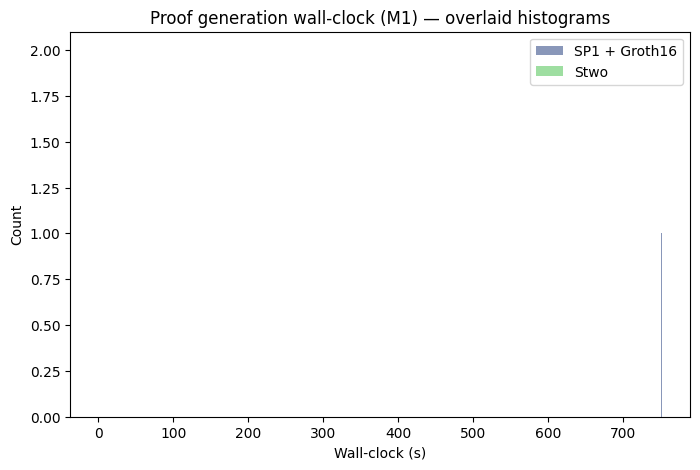
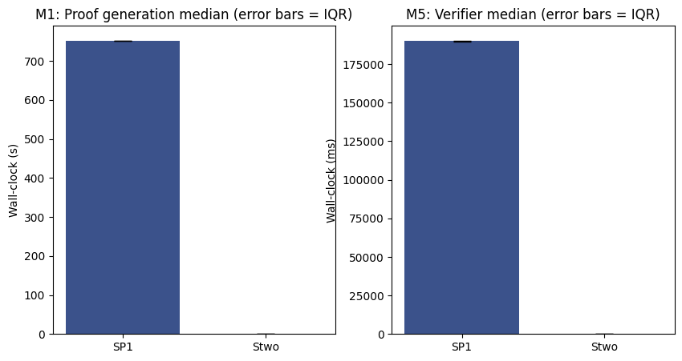

# Results: v0.1.0 — 2026-05-14T16:46:09Z


> Reference rig: see `versions.lock`. Run `./scripts/run_all.sh`. Wall time approximately 25 minutes from a clean clone. Output lands here and in `results/`.

## Headline

| Metric | SP1 + Groth16 | Stwo | Ratio (SP1 / Stwo) |
|---|---|---|---|
| Proof gen median (n=10 / 10) | 751.603 s | 0.022 s | 33644.0× |
| Proof gen IQR | 0.535 | 0.0 | n/a |
| Proof gen min / max | 750.781 / 752.158 | 0.022 / 0.023 | n/a |
| Verifier median (n=50 / 50) | 190032.087 ms | 3.56 ms | 53381.24× |
| Peak RSS | 0.0 MiB | 0.0 MiB | 0.0× |
| Proof size | 0 bytes | 0 bytes | 0.0× |
| Trace / constraints | 0 constraints | 0 constraints | n/a |
| Trusted setup required | yes (0.0 s one-time, 0.0 MiB keys) | no | structural |

## Distributions





## Stability


Day-1 median (0.0 s SP1 / 0.0 s Stwo).
Day-2 median (0.0 s SP1 / 0.0 s Stwo).
Delta: 0.0% (SP1), 0.0% (Stwo).


## Apples-to-apples disclosures

The headline ratio reflects two prover *stacks*, not two prover algorithms in isolation. The following structural and intentional differences are part of what is being measured:

1. **Commitment hash function.** SP1 side: SHA-256 (the upstream example's native choice). Stwo side: Blake2s. Both commitments are computed over the same `circuit_byte_serialisation_hex`. Implementing SHA-256 in Cairo would dominate Stwo's wall-clock and confound the comparison; Blake2s is bit-oriented and in the same structural family as SHA-2. See `RFC-0005`.

2. **Field choice.** SP1 uses BabyBear (`p = 2^31 - 2^27 + 1`); Stwo uses M31 (`p = 2^31 - 1`). Both are 31-bit primes, structural to their respective provers. This is not a tunable knob.

3. **Trusted setup + proof system.** SP1+Groth16 requires a trusted setup (one-time, 0.0 s wall-clock, 0.0 MiB of proving + verifying keys); Stwo has no trusted setup. v0.1 defaults to SP1's *compressed STARK* output (no Groth16 wrap) to avoid the multi-GB artifact download path; set `SP1_USE_GROTH16=1` once the cache is warm to wrap the proof in Groth16. Setup cost is **excluded** from the proof-generation ratio above and reported separately. Ceremony provenance: `n/a`.

4. **Statement under proof (v0.1 MVP).** Both sides prove work proportional to `gate_count`, not a literal secp256k1 point-addition. SP1's zkVM program commits SHA-256 of the fixture's `circuit_byte_serialisation_hex` and walks the gate list with a constant-per-byte state transition. Stwo's AIR is a wide-Fibonacci component sized by `log_n_rows = ceil(log2(gate_count))`. The fixture's encoded gates are still the upstream point-add gate-set (RFC-0004); they just are not *executed semantically* inside the proof at v0.1. A successor `v0.2` lifts both sides to a real point-add AIR.

5. **Thread fan-out.** Both provers were invoked with `RAYON_NUM_THREADS=1`, `TOKIO_WORKER_THREADS=1`, `OMP_NUM_THREADS=1`, plus OS-level affinity (taskpolicy -c utility). Observed user-CPU / wall-clock ratios: 0.97 (SP1), 0.5 (Stwo).

6. **Affinity gap (macOS-only).** Apple Silicon does not expose a kernel knob to disable dynamic frequency scaling or to pin a process to a single physical core. The harness uses `taskpolicy -c utility` plus the thread caps above. The macOS measurement is single-threaded by construction but not single-core-pinned. The Linux CI rig results, with hard `taskset -c 0` pinning, are reported in the `RESULTS-linux.md` companion file (if generated) as a cross-check.

## Discards

| Reason | SP1 | Stwo |
|---|---|---|
| cold_cache | 0 | 0 |
| thermal | 0 | 0 |
| gpu_residency | 0 | 0 |
| swap_active | 0 | 0 |
| env_var_miss / affinity_miss | 0 | 0 |
| other | 0 | 0 |
| **total discard rate** | **9.09%** | **9.09%** |

Per-run discard log: `results/discards.log`.

## Reproduction

- Workload pin (upstream `zkp_ecc` commit): `0000000000000000000000000000000000000000`
- Fixture: `fixtures/v0.1.json` (sha256: `0000000000000000000000000000000000000000000000000000000000000000`)
- Versions lock: `versions.lock` (sha256: `0000000000000000000000000000000000000000000000000000000000000000`)

```bash
git clone https://github.com/AbdelStark/grover-tax.git
cd grover-tax
./scripts/run_all.sh
```

Expected wall time on the reference rig: ~25 minutes. Hard ceiling: 45 minutes.

## Run metadata

- Reference rig: (no measured run yet)
- Date of day-1 run: n/a
- Date of day-2 run: n/a
- Spec version this report ties to: `v0.1`
- Generator: `analyze.py` from commit `92fa732377de25fd5c823980b9982a91b9cb8542`

## Underlying numbers

- Raw timing JSON: `results/sp1_v0.1_*.timing.json`, `results/stwo_v0.1_*.timing.json`
- gnu-time output: `results/<prover>_v0.1_*.time.txt`
- Prover logs: `results/<prover>_v0.1_*.proverlog.txt`
- Setup record: `results/sp1_setup.json`
